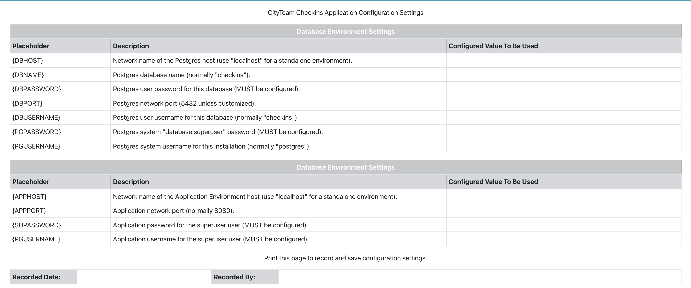

# CityTeam Checkins Application

Welcome to the CityTeam Checkins Application, designed to assist CityTeam
Facilities, which accommodate overnight Guests, to be registered for
a particular mat (or other bedding system), and optionally request early
wakeup notification, or an early shower notification.

The software is built upon open source and/or free software components
(Postgres database, Node.JS, Typescript, Express, Sequelize, React, Axios)
and can be installed in environments ranging from a standalone (everything
installed on a single laptop) to a cloud based environment, supporting
multiple Facilities.

Detailed documentation can be found by following one of these links:
* [Installating the Application](./INSTALLATION.md)
* [Developer Support](./DEVELOPER.md)

The installation process encourages you to keep track of your choices for
configuration variables and secrets like passwords.  This form is available
via the online help, or by printing this page:

